# arch

My infrastructure as code project - 複数のクラウドプロバイダー（AWS、Cloudflare）にわたってTerraformとTFActionを使用した宣言的なインフラストラクチャー管理プロジェクトです。

## システムアーキテクチャ

以下の図は、このプロジェクトで管理している全体的なシステム構成を示しています：

### 主要コンポーネント

#### 物理インフラ
- **Orange Pi Zero 3 クラスター**: shanghai-1、shanghai-2、shanghai-3の3ノード構成
- **kube-vip**: 高可用性のためのVirtual IPによる負荷分散

#### Kubernetes サービス
- **ArgoCD**: GitOpsによる継続的デプロイメント
- **Grafana & Prometheus**: メトリクス監視とダッシュボード
- **Longhorn**: 分散ブロックストレージ
- **HitoHub & OpenHands**: メインアプリケーション
- **External Secrets Operator**: AWS SSM Parameter Storeからのシークレット管理

#### AWS サービス
- **ECR**: コンテナイメージレジストリ
- **SSM Parameter Store**: セキュアなシークレット管理
- **S3**: Longhornバックアップとシステムイメージ保存
- **IAM**: GitHub Actions OIDC統合とサービスアカウント

#### Cloudflare サービス
- **DNS**: ドメイン管理（b0xp.io、boxp.tk）
- **Tunnels**: セキュアな外部アクセス
- **Zero Trust**: 認証とアクセス制御
- **Pages**: 静的サイトホスティング

#### 自動化ツール
- **Terraform**: Infrastructure as Code
- **TFAction**: GitHub Actions経由のTerraform自動化
- **Ansible**: 構成管理とシステムセットアップ
- **Aqua**: ツールバージョン管理
- **Renovate**: 依存関係の自動更新

### 関連プロジェクト

このインフラストラクチャは [lolice](https://github.com/boxp/lolice) Kubernetesプロジェクトの基盤として機能し、アプリケーションのデプロイメントとオーケストレーションをサポートしています。
