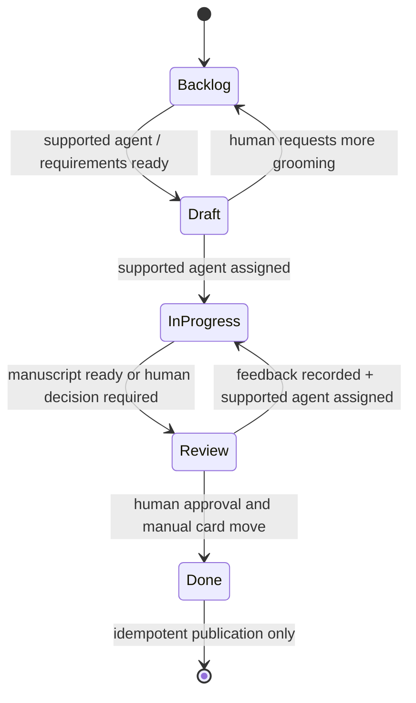

# Novel Board runner 仕様

## 1. 目的と source of truth

Novel Board runner は Obsidian vault の `Boards/Novel Board.md` を監視し、小説カード単位の要件整理と執筆を実行する。現在レーンを唯一の状態 source of truth とし、`Novels/<ID>.md` の `status` が不一致なら、runner は管理ノートをレーンへ同期する。永続 run state、lock、過去の管理ノート status から Board を巻き戻さない。

既存の `Boards/Task Board.md`、`Tickets/`、Task Board runner root、日次小説 cron、既存小説は対象外とする。

## 2. Board とカード形式

レーンは次の順序で固定する。

````markdown
---
kanban-plugin: board
---

# Novel Board

## Backlog
## Draft
## In Progress
## Review
## Done

%% kanban:settings
```json
{"kanban-plugin":"board","show-checkboxes":false}
```
%%
````

カードは一行で記述し、正規タグ `#novel` を必須とする。

```markdown
- [ ] [[Novels/NOVEL-1|NOVEL-1: タイトル]] #novel status::backlog assignee::codex
- [ ] [[Novels/NOVEL-2|NOVEL-2: 成人向けタイトル]] #novel #nsfw status::review assignee::boxp
```

- ID は `[A-Za-z0-9][A-Za-z0-9._-]*`。
- `assignee::` は管理ノート frontmatter の `assignee` と同期する。カード値があればカードを優先する。
- `#nsfw` 判定はカード上の空白区切り正規タグだけを使う。管理ノート本文の文字列や類似タグは判定に使わない。
- Board lane と card `status::` が不一致なら lane を優先して card metadata と管理ノートを同期する。

## 3. 状態遷移



runner が自動で行う遷移は `Backlog -> Draft`、`Draft -> In Progress -> Review`、`Review -> In Progress -> Review` だけである。`Review -> Done` と `Draft -> Backlog` は人間が Board 上で行う。

## 4. 状態別責務

| レーン | 開始条件 | agent の作業 | 成果物 | 成功時遷移 | 失敗・判断待ち | 再開条件 |
| --- | --- | --- | --- | --- | --- | --- |
| `Backlog` | supported assignee がカードまたは管理ノートにある | 本文を書かず、タイトル、あらすじ、登場人物、文体・視点、対象読者、目標文字数、必須要素、禁止事項、参照資料、NSFW、章立て・アウトラインを整理 | 管理ノートの `## Requirements` と `## Outline`、run log | `Draft`、assignee を `boxp` | 要件不足・agent 異常は理由と必要入力を `## Run History` に記録し `Draft` で人間確認 | 人間が `Draft -> Backlog` へ戻して supported agent を割り当てる |
| `Draft` | human review point。未アサイン/人間担当は停止。supported agent が割り当てられた時だけ開始 | lane を `In Progress` へ同期して、承認済み条件から初稿を作成 | private work dir の `manuscript.md`、管理ノートの作業原稿リンク、変更履歴、run log | 原稿がレビュー可能なら `Review`、assignee を `boxp` | 実行失敗・要件不足・判断待ち理由を記録し `Review` | 人間が Review 指示を記載し supported agent を割り当てる |
| `In Progress` | supported agent が割り当てられている。通常は Draft/Review から runner が遷移 | 既存 `manuscript.md`、最新 `## Review Instructions`、要件、履歴を読み、初稿または改稿を継続 | 同じ `manuscript.md`、`## Change History`、run log | `Review`、assignee を `boxp` | 理由と再開条件を記録し `Review` | Review 指示と supported agent の再割当 |
| `Review` | human review point | 原則停止。runner は承認を推測しない | 人間の review result / instruction | 人間が承認時に `Done` へ手動移動。修正時は supported agent を割り当てると runner が `In Progress` へ移す | 判断待ちのまま維持 | 修正指示 + supported agent、または人間承認 + Done への移動 |
| `Done` | 人間が Review から Done へ移動済みで `manuscript.md` が存在 | 執筆 agent は起動せず、完成版を冪等配置して管理ノートへリンク | timestamp 付き完成版、`published-path` / `published-at` | なし | 原稿欠落、path 衝突、無効な title は管理ノートへ記録し Done を維持 | 原稿・title を人間が修正。次 tick で配置を再試行 |

## 5. 管理ノート

管理ノートは `Novels/<ID>.md` とし、最低限次を持つ。

```yaml
---
id: NOVEL-1
type: novel
status: backlog
title: タイトル
assignee: boxp
nsfw: false
work-dir: /home/boxp/.novel-board/work/NOVEL-1
manuscript: /home/boxp/.novel-board/work/NOVEL-1/manuscript.md
published-path:
published-at:
---
```

本文 section は `Requirements`、`Outline`、`Review Instructions`、`Change History`、`Run History` を固定見出しとして用意する。runner は既存指示と履歴を追記し、削除しない。

runner が書き戻す文字列 frontmatter 値は JSON 互換の YAML double-quoted scalar とし、タイトル中の `: `、`#`、引用符、改行で YAML を破損しない。

未知または未設定 assignee は agent を起動しない。管理ノートが存在するカードについては、同一理由を連続重複させない形で `Run History` に skip 理由と対応可能一覧を記録する。

## 6. 保存先と権限

- 永続状態: `/home/boxp/.novel-board/` (`0700`)
- lock: `/home/boxp/.novel-board/locks/<ID>.edn`
- run log: `/home/boxp/.novel-board/runs/<ID>/<run-id>/`
- 作業原稿: `/home/boxp/.novel-board/work/<ID>/manuscript.md` (`0600`)
- prompt snapshot / stdout / stderr / result: run directory (`0700` directory、`0600` file)

NSFW と SFW の作業中原稿はどちらも private root に置く。NSFW は管理ノートに本文を埋め込まず、絶対 path のみ記録する。`Done` 前に完成版フォルダへコピーしない。root は home PVC 上にあり、Novel runner と明示的に許可された workspace user だけがアクセスする。

## 7. 完成版配置

Done tick 時点のカードに正規タグ `#nsfw` があれば `NSFW/小説/AI執筆/`、なければ `小説草案/AI執筆/` を選ぶ。片方だけに配置し、もう片方には作らない。

ファイル名は日本標準時の `YYYY-MM-DD-HH-mm_タイトル.md`。title は path separator と制御文字を除去する。同名が存在する場合は上書きせず配置失敗として記録する。

冪等性は管理ノートの `published-path` に加え、card lock と `published.edn` に保存する `novel-id`、原稿 SHA-256、path、timestamp、reservation status で保証する。コピー前に destination と原稿 SHA-256 を予約し、同じディレクトリの private staging file へコピーしてハッシュを検証した後、最終 path へ atomic move する。さらに canonical destination path 単位の OS file lock と永続 reservation を private root で共有し、別 process・別 card が同一分に同一 title を公開しても、存在確認から atomic move・確定までを直列化する。先に destination を予約した card だけが中断コピーを復旧でき、別 card は完成版を削除・置換しない。予約状態の最終 path が存在する場合も予約ハッシュを検証し、旧 runner の中断コピーによる不完全ファイルなら同じ予約 path へ完全な原稿を再配置する。`published` 状態のハッシュ不一致や未予約・他 card 予約済みの同名ファイルは上書きしない。Done 再走査やコピー直後の runner 再起動でも同一 ID の完成版は増えない。管理ノートには vault 相対 wiki link を残す。

## 8. assignee と CLI route

Task Board runner の実装時点の route を Novel runner に同じ名前で実装する。

| assignee | CLI | model / route |
| --- | --- | --- |
| `codex`, `codex-terra` | `codex exec` | `gpt-5.6-terra` |
| `codex-sol`, `codex-full` | `codex exec` | `gpt-5.6-sol` |
| `codex-mini` | `codex exec` | `gpt-5.6-luna` |
| 上記 + `-minimal/-low/-medium/-high/-xhigh` | `codex exec` | 同じ model + `model_reasoning_effort` |
| `fable` | `claude --print` | `CODEX_NOVEL_BOARD_FABLE_MODEL` 未設定時は Claude CLI default |
| `pi` | `pi --print` | `CODEX_NOVEL_BOARD_PI_MODEL` 未設定時は Pi default（provider は環境設定） |

全 route は同じ prompt contract を受け、最後に `NOVEL_BOARD_RESULT: review` または `NOVEL_BOARD_RESULT: blocked` を返す。groom は exit 0 なら結果 marker に関係なく Draft、人間判断を必要とする執筆 run は Review へ戻す。Pi は `--session-dir <run-dir>/pi-session`、`--approve`、任意の `--model` を使い、同じ原稿を filesystem から再開する。会話 session の永続性には依存しない。

## 9. lock、異常終了、再起動

- lock 作成は atomic file create とし、同一 ID の二重起動を防ぐ。
- Board の card move / metadata 更新は private root の `board.lock` でプロセス間直列化し、異なるカードを並行処理する runner 同士の read-modify-write lost update を防ぐ。card lock 取得後は現在の Board を再読込し、別 runner が既に遷移済みなら古い snapshot の作業を再実行しない。
- agent 完了後も `board.lock` 下で現在レーンを再読込し、開始時の処理対象レーンのままの場合だけ成功・失敗先へ自動遷移する。実行中に人間がカードを移動した場合はそのレーンを維持し、runner は過去の状態へ戻さない。
- lock は `owner-id`（Pod UID）、`runner-instance-id`、`pid`、`action`、`lane`、`started-at`、`heartbeat-at` を持つ。
- agent 実行中は heartbeat を更新する。fresh lock は owner に関係なく回収しない。
- heartbeat が `CODEX_NOVEL_BOARD_LOCK_STALE_SECONDS`（既定 180 秒）を超えた lock は stale として run を `interrupted` にし、管理ノートへ再開理由を記録して削除する。
- SIGTERM/preStop は owner marker を作るが、旧 runner または agent の生存中に二重起動しないよう、次の instance は marker だけでは lock を回収しない。heartbeat が stale になって旧処理の停止を確認できた場合だけ回収し、marker は対応する lock が残る間保持する。異常終了時も同じ stale fallback を使う。
- 回収後も Board lane を優先する。Backlog/Draft/Review/In Progress/Done のどの状態も過去 run から巻き戻さない。
- agent exit 非 0、marker 欠落、要件不足、判断待ちは `Review` へ移し、理由と再開条件を記録する。Done publish 失敗だけは Done を維持する。

## 10. runner command と環境変数

```text
novel_board_runner.bb <tick|loop|sync|prepare-shutdown|recover>
```

codex-workspace image の既定 entrypoint は `CODEX_WORKSPACE_ROLE=novel-board-runner` の場合、root 起動なら `/home/boxp` の owner と private root の `0700` mode を初期化して `runuser` で権限を落とし、既に `boxp` UID なら private root を `0700` にしてそのまま、いずれも `HOME=/home/boxp` を設定した `boxp` user として `novel_board_runner.bb loop` を `exec` する。root でも `boxp` でもない UID は起動を拒否する。その後の通常 workspace 初期化へは進まない。配備側の独立 sidecar はこの role を設定して image の起動契約を使う。role 未設定時は通常 workspace のままであり、同一コンテナ内に runner を追加起動しない。

主な環境変数:

- `CODEX_WORKSPACE_ROLE`（Novel sidecar では `novel-board-runner`、通常 workspace では未設定）
- `CODEX_NOVEL_BOARD_VAULT`（既定 `/home/boxp/Documents/obsidian-headless/BOXP`）
- `CODEX_NOVEL_BOARD_ROOT`（既定 `/home/boxp/.novel-board`）
- `CODEX_NOVEL_BOARD_OWNER_ID`、`CODEX_NOVEL_BOARD_POLL_SECONDS`、`CODEX_NOVEL_BOARD_LOCK_STALE_SECONDS`
- `CODEX_NOVEL_BOARD_MODEL`、`CODEX_NOVEL_BOARD_PROFILE`
- `CODEX_NOVEL_BOARD_FABLE_MODEL`、`CODEX_NOVEL_BOARD_PI_MODEL`
- `CODEX_NOVEL_BOARD_BYPASS_APPROVALS`（既定 `false`。明示的に `true` を指定した場合だけ Codex / Fable の approval・sandbox bypass を有効化）、`CODEX_NOVEL_BOARD_SANDBOX`（既定 `workspace-write`）

## 11. テストと既知制約

black-box test は一時 vault と fake `codex` / `claude` / `pi` を使い、主要遷移、review stop/restart、全 route、SFW/NSFW、冪等 publish、上書き禁止、別 process・別 card の同一 destination 競合、active/stale lock、lane/status sync、agent failure を再現する。

既知制約:

- 人間承認は Board の `Review -> Done` 手動移動で表現し、署名や複数承認は扱わない。
- 管理ノート editor と runner の同時編集は file lock の対象外なので、review 指示保存後に assignee を変更する。
- 完成版配置後の `#nsfw` 変更は自動移動しない。誤分類時は人間が公開ファイルと `published-path` を監査して明示修正する。
- agent が契約外の場所を編集しないよう prompt で制約するが、OS-level sandbox の強度は選択 CLI と Deployment 設定に依存する。
